<div align="center">



<br>

[](https://www.linkedin.com/in/krishna-jain-4160b62a6/)
[](mailto:jainkrishna1502@gmail.com)
[](https://krishnajain.codes)
[](https://github.com/KRISHNA-JAIN15)

<sub>[`whoami()`](#about) · [`experience.log`](#experience) · [`projects/`](#projects) · [`skills.json`](#skills) · [`achievements.md`](#achievements) · [`stats`](#stats)</sub>

</div>

<br>

<a id="about"></a>

### `$` whoami

```bash
$ whoami
Krishna Jain — Full-stack engineer & CS undergrad, IIIT Sri City (GPA 9.3/10.0)

$ cat interests.txt
Distributed systems, AI agent infrastructure, and shipping things
that don't fall over under load.

$ echo $CURRENT_FOCUS
"Building production backend systems @ Soundverse AI"
```

<br>

<a id="experience"></a>

### `$` cat experience.log

```text
commit a1e9c02 (HEAD -> main)
Author: Krishna Jain <jainkrishna1502@gmail.com>
Date:   Feb 2026 – May 2026

    SDE Intern @ Soundverse AI · Remote

    * Built chat-interface features & backend APIs powering automated
      song insights, script-to-video scene assembly, and parallel tool
      execution
    * Architected an AWS SES + BigQuery telemetry pipeline for real-time
      email analytics, surfaced through a custom admin dashboard
    * Shipped a multi-tenant Workspace platform — Stripe billing and an
      Invite-to-Earn token economy
    * Added auto-retry backoff to the AI agent pipeline for reliable
      streaming under load

commit 7f3d81b
Author: Krishna Jain <jainkrishna1502@gmail.com>
Date:   Jul 2024 – Aug 2024

    Model Developer & Optimization Intern @ Renew Energy · On-site

    * Devised and validated computational models to optimize energy
      output through rigorous data analysis
    * Built dynamic pipelines that auto-select the best-fit model per
      input, improving processing efficiency
```

<br>

<a id="projects"></a>

### `$` ls -la ~/projects

```bash
$ ls -la ~/projects
drwxr-xr-x  feasto/      # hyper-local food delivery marketplace
drwxr-xr-x  nutrify/     # AI-native nutrition & fitness platform
drwxr-xr-x  envy/        # "git for .env" — secret management platform
```

**`feasto/`** — hyper-local food delivery marketplace
Microservices platform connecting customers, restaurants, and riders — 10+ services orchestrated with Docker & Kafka.
- Real-time order tracking, rider assignment, and status updates over a Kafka-backed event pipeline
- GraphQL API gateway with Redis caching, cutting API latency by 35%
- Razorpay payments and MapBox live rider tracking
- Dual React 18 dashboards behind NGINX, auto-deployed to Oracle Cloud via GitHub Actions

`Docker` `Kafka` `GraphQL` `Redis` `React` `NGINX` `Oracle Cloud` · [repo →](https://github.com/KRISHNA-JAIN15/feasto)

**`nutrify/`** — AI-native nutrition & fitness platform · *Selected, Swiggy Builder Club*
Full-stack wellness platform with agentic AI coaching, built on FastAPI, React 18, and MongoDB Atlas.
- MCP-powered agent with 20+ tools for nutrition estimation, meal planning, hydration, and workout tracking
- Swiggy MCP integration for AI-assisted food ordering with automatic meal logging
- Distributed on Oracle Cloud with Redis, Celery, Grafana Alloy, SSE, and Azure OpenAI for real-time observability

`FastAPI` `React` `MongoDB` `Celery` `Redis` `Grafana` `Azure OpenAI` · [repo →](https://github.com/KRISHNA-JAIN15/nutrify)

**`envy/`** — *"git for .env"* — secret management platform
MERN dashboard for centralized secret management with granular access control, audit logging, and version history.
- Secure CLI agent with AES-256 encryption and in-memory process injection — zero disk persistence
- Published on PyPI, cutting team onboarding time by 50%

`MongoDB` `Express` `React` `Node.js` `PyPI` `AES-256` · [repo →](https://github.com/KRISHNA-JAIN15/envy)

<br>

<a id="skills"></a>

### `$` cat skills.json

```json
{
  "languages": ["JavaScript", "TypeScript", "Python", "Java", "SQL", "HTML5", "CSS3"],
  "frameworks": ["React", "Next.js", "Node.js", "Express", "FastAPI", "Flask", "GraphQL", "TailwindCSS", "LangChain"],
  "data_infra": ["MongoDB", "PostgreSQL", "MySQL", "Redis", "Prisma", "Apache Kafka", "Docker", "Celery"],
  "cloud_tools": ["AWS (EC2, Lambda, S3, SES)", "Oracle Cloud", "GitHub Actions", "NGINX", "Postman"],
  "currentlyExploring": "distributed systems & AI agent infrastructure"
}
```

<div align="center">


</div>

<br>

<a id="achievements"></a>

### `$` cat achievements.md

```diff
+ Best Paper Award — IEEE CONECCT 2026
+   "A Potential-Field Guided Chaotic Opposition-Based Sparrow Search
+    Algorithm for Global Optimization"

+ Paper Accepted — IEEE CONECCT 2026
+   "A Topological Data Analysis Framework for EEG-Based Stress
+    Classification"

+ Selected — Amazon ML Summer School 2026, Amazon India
+ 2nd Runner-Up — AgriAI Hackathon, Abhisarga '25 (IOTA, IIIT Sri City)
+ Co-Lead — Epoch, Machine Learning Club @ IIIT Sri City
```

<br>

<a id="stats"></a>

### `$` git log --stat --author=krishna

<div align="center">


</div>

<br>

<!-- contribution-snake-start -->
<div align="center">

</div>
<!-- contribution-snake-end -->

<br>

---

<div align="center">

```bash
$ echo "always open to interesting problems — reach out"
```

[](https://www.linkedin.com/in/krishna-jain-4160b62a6/)
[](mailto:jainkrishna1502@gmail.com)
[](https://krishnajain.codes)

<sub></sub>

</div>
